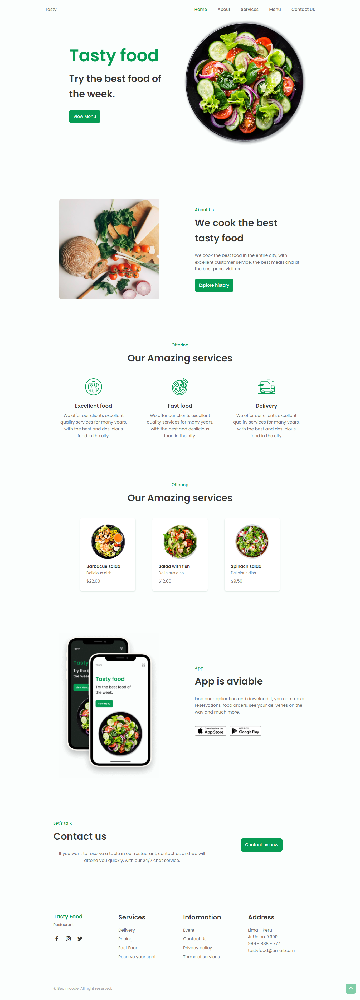

<div align="center">
    <h1 align="center">Create a Responsive Restaurant Website Design Using HTML CSS & JavaScript 🥗</h1>
    <p>Nice design of a responsive restaurant website 🥗 . It contains a header, home, about, services, menu, app, contact and a footer. It also has a fully developed light/dark mode 🌓 first for mobile then for desktop.</p>
    
</div>

---
<h3 align="center">
  <a href="https://responsive-restaurant-website.vercel.app/">Acessar demonstração</a>
</h3>

## Índice

* [Descrição](#descrição)
* [Techs](#techs)
* [Design](#design)
  * [Cores](#cores)
  * [Tipo de fonte](#tipo-de-fonte)
  * [Pacote de ícones](#pacote-de-ícones)
* [Instalação](#instalação)
* [Links Contato](#links-contato)

# Descrição
Criação de um site de restaurante para treino e fixação dos conteúdos aprendendido durante a aula [**@Bedimcode**](https://www.youtube.com/c/Bedimcode)

# Techs: 
- **HTML**
- **CSS**
- **Javascript**

# Design:
- O modelo final para desktop está disponível na pasta `./design`
- Imagens disponíveis na pasta `./assets`<br>

## Cores:
--first-color: #069C54;<br>
--first-color-alt: #048654;<br>
--title-color: #393939;<br>
--text-color: #707070;<br>
--text-color-light: #A6A6A6;<br>
--body-color: #FBFEFD;<br>
--container-color: #FFFFFF;<br>

## Tipo de fonte:
- **Poppins** Regular 400, Medium 500, Bold 700


## Pacote de ícones:
- **Boxicons**

# Instalação:
```bash
  # Clone este repositório:
  $ git clone https://github.com/GabrielChagas1/responsive-restaurant-website.git
  $ cd ./responsive-restaurant-website
```

# Links Contato
- **Linkedin:** https://www.linkedin.com/in/gabriel-serqueira-chagas/<br>
- **GitHub:** https://github.com/GabrielChagas1<br>